# Scriba - System Architecture & Project Flow

This document details the internal design, algorithmic implementations, and execution pipelines of **Scriba**, showing exactly how data flows through the recommendation and trend analysis systems.

---

## 1. System Overview & Architecture

Scriba is designed using a **modular, decoupled architecture**:
* **Frontend Layer**: A responsive single-page application built with HTML5, CSS3 (Glassmorphic CSS Variables), and JavaScript. It communicates with the backend exclusively via REST APIs and utilizes **Chart.js** for visual renderings.
* **Backend Controller (`app.py`)**: A lightweight Flask server exposing endpoints for search, retrieval, keyword extraction, and analytics. It handles multi-part file uploads (PDF/TXT) and parses PDFs dynamically.
* **Engine Core (`engine/`)**: A modular math and NLP pipeline implementing:
  * Keyphrase extraction (**RAKE**)
  * Text Vectorization and Similarity (**TF-IDF + Cosine Similarity**)
  * Citation & Temporal metadata scoring (**Log-Normalization & Exponential decay**)
  * Machine Learning clustering & projection (**K-Means & PCA**)

---

## 2. Complete Project Flow

The following sequence diagram maps out how data is processed when a user interacts with the system:

```mermaid
sequenceDiagram
    autonumber
    actor User
    participant UI as Web Interface (JS)
    participant Flask as Flask Server (app.py)
    participant PDF as PDF Parser (pypdf)
    participant RAKE as RAKE Extractor (rake.py)
    participant Rec as Hybrid Recommender (recommender.py)
    participant Cluster as Clustering & PCA (clustering.py)
    participant DB as CSV Database (papers.csv)

    %% Startup Flow
    Note over User, DB: A. SYSTEM STARTUP
    Flask->>DB: Load papers.csv
    Flask->>Rec: Initialize & fit TF-IDF vectorizer on dataset abstracts
    Flask->>Cluster: Execute K-Means clustering and PCA coordinates (X, Y)
    User->>UI: Open browser at http://127.0.0.1:5000/
    UI->>Flask: GET /api/trends
    Flask->>UI: Return PCA coordinates, categories, and growth metrics
    UI->>User: Render 2D Scatter Plot & Trend Charts

    %% Upload & Recommendation Flow
    Note over User, DB: B. UPLOAD & RECOMMENDATION FLOW
    User->>UI: Upload PDF research paper
    UI->>Flask: POST /api/recommend (Multipart file payload)
    
    rect rgb(30, 40, 60)
        Note over Flask, PDF: Text Extraction Phase
        Flask->>PDF: Parse uploaded PDF document
        PDF->>Flask: Return extracted raw text
    end
    
    rect rgb(30, 40, 60)
        Note over Flask, RAKE: Natural Language Processing
        Flask->>RAKE: Extract key phrases from raw text
        RAKE->>Flask: Return sorted list of keywords with RAKE scores
    end

    rect rgb(30, 40, 60)
        Note over Flask, Rec: Hybrid Recommendation Phase
        Flask->>Rec: Find matches for extracted text (weights: Sim, Cite, Recency)
        Rec->>DB: Query paper details & metadata
        Rec->>Rec: Compute TF-IDF similarities & metadata score boost
        Rec->>Flask: Return top 10 recommended papers with score breakdowns
    end

    Flask->>UI: Return keywords & recommendation list (JSON)
    UI->>User: Display keyword tags and similar papers with match percentages
    
    %% Add Paper Flow
    Note over User, DB: C. DATABASE INSERTION FLOW
    User->>UI: Click "Add Research Paper" & submit form
    UI->>Flask: POST /api/add-paper (JSON payload)
    Flask->>DB: Append new record to papers.csv
    Flask->>Rec: Reload CSV & re-fit TF-IDF vectorizer
    Flask->>UI: Return success confirmation
    UI->>Flask: GET /api/trends (Request fresh layout)
    Flask->>Cluster: Run K-Means & PCA on updated dataset
    Cluster->>UI: Return updated 2D coordinates & cluster labels
    UI->>User: Redraw 2D Scatter plot containing the new paper node
```

---

## 3. Detailed Algorithmic Operations

### A. RAKE (Rapid Automatic Keyword Extraction) - `engine/rake.py`
The RAKE algorithm extracts terms based on co-occurrence relationships:
1. **Stop-word Delimitation**: The raw text is cleaned, tokenized, and split into sequences of content words by treating stop-words as partitions:
   $$\text{"A deep learning framework for graph neural networks"} \longrightarrow \text{["deep learning framework", "graph neural networks"]}$$
2. **Frequency & Degree Calculation**:
   * **Frequency ($freq(w)$)**: How many times word $w$ appears in any candidate phrase.
   * **Degree ($deg(w)$)**: The sum of the lengths of all candidate phrases containing word $w$. If $w$ appears in long phrases, its degree is high.
3. **Word Score**:
   $$\text{Score}(w) = \frac{deg(w)}{freq(w)}$$
4. **Phrase Score**: Calculated as the sum of the scores of its member words. The top phrases are returned to the user.

### B. Hybrid Recommender Engine - `engine/recommender.py`
When an abstract text is evaluated, the system computes the similarity score using three components:
1. **Text Similarity (Cosine Similarity)**:
   We construct a TF-IDF vector for the query abstract ($\vec{q}$) and calculate the cosine of the angle between $\vec{q}$ and each document vector in the database ($\vec{d}$):
   $$\text{CosineSimilarity}(\vec{q}, \vec{d}) = \frac{\vec{q} \cdot \vec{d}}{\|\vec{q}\| \|\vec{d}\|}$$
2. **Log-Citations Normalization**:
   Citations vary exponentially. To avoid highly-cited papers dominating recommendations, we apply a logarithmic compression and normalize the value against the maximum citations in the database ($C_{\text{max}}$):
   $$\text{CitationScore} = \frac{\ln(1 + C)}{\ln(1 + C_{\text{max}})}$$
3. **Exponential Recency Decay**:
   Temporal relevance is modeled using an exponential decay curve based on the publication year ($Y$) relative to the current year ($2026$):
   $$\text{RecencyScore} = e^{-\lambda \cdot (2026 - Y)}$$
   *Here, $\lambda = 0.15$, meaning a paper's score drops by $50\%$ in approximately $4.6$ years, promoting active and recent research.*

4. **Linear Weight Combination**:
   The final match score merges these features linearly:
   $$\text{MatchScore} = w_{\text{sim}} \cdot \text{CosineSimilarity} + w_{\text{cite}} \cdot \text{CitationScore} + w_{\text{time}} \cdot \text{RecencyScore}$$
   *Where $w_{\text{sim}} + w_{\text{cite}} + w_{\text{time}} = 1.0$ (configured dynamically in the UI).*

### C. Dimensionality Reduction & PCA - `engine/clustering.py`
To map papers visually:
1. **K-Means Clustering**: The collection of paper TF-IDF vectors is partitioned into $K=5$ clusters using standard Euclidian distance optimization.
2. **Centroid Descriptive Tagging**: For each cluster, the algorithm locates the centroid vector (the average point) and selects the 4 terms with the highest weights to create descriptive cluster labels (e.g. "Transformer & Large & Language & Model").
3. **PCA Projection**: High-dimensional TF-IDF vectors (often $1,000+$ features) are projected down into $2$ principal components ($X, Y$) by calculating the eigenvectors of the covariance matrix. This retains maximum variance and maps similarity relationships in 2D.
