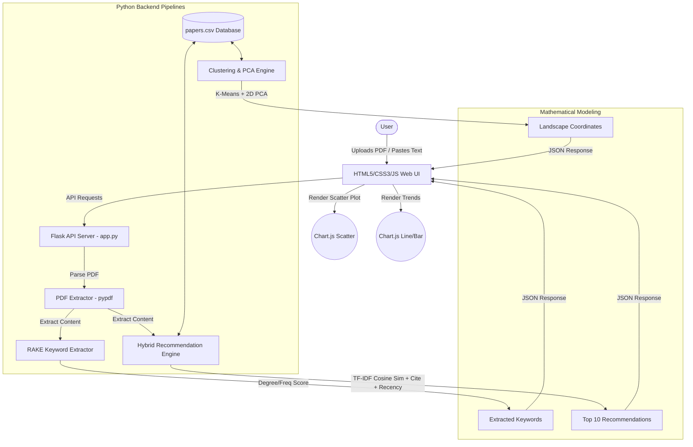
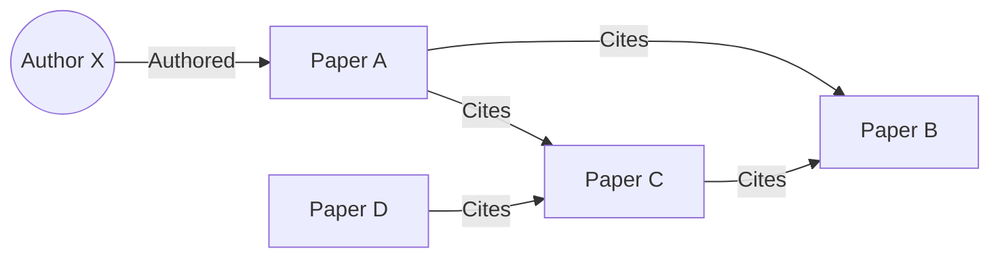

# Project Synopsis & Academic Presentation Guide

This document contains the standard academic **Project Synopsis**, presentation strategies, and a detailed plan for **Future Scope & Enhancements** for your MCA mini-project: **Scriba - Research Paper Recommendation & Trend Analysis System**.

---

## 🎓 Part 1: Academic Presentation Strategies
To secure maximum marks from external examiners, structure your presentation to emphasize the **algorithms** and **design decisions** rather than just showing the UI.

### 1. Slide Deck Structure (Recommended 10-12 Slides)
1. **Title Slide**: Project Title, your name, register number, and guide's name.
2. **Introduction & Motivation**: Why is search difficult for researchers? (Keyword matching vs. semantic matching).
3. **Problem Statement**: Standard search engines don't balance recency, citation impact, and text relevance simultaneously.
4. **Objectives**: What does your system achieve? (Offline operation, custom keyphrase extraction, unsupervised landscape clustering).
5. **System Architecture**: High-level block diagram showing the data flow (from PDF upload to frontend charts).
6. **Core Algorithms (Slide 1 - Keyword Extraction)**: Detail the RAKE algorithm (Splitting, Co-occurrence matrix, word scoring).
7. **Core Algorithms (Slide 2 - Recommendation Formula)**: Show the hybrid recommendation scoring formula.
8. **Core Algorithms (Slide 3 - Unsupervised Clustering)**: Detail K-Means and PCA (dimensionality reduction).
9. **Implementation Stack**: Flask, Python (scikit-learn, pandas, numpy, pypdf), HTML5/CSS3 (Glassmorphic dashboard), and Chart.js.
10. **Demo Highlights**: Show screenshots or run the live interface (the 2D scatter plot and PDF upload are great crowd-pleasers).
11. **Future Scope**: How this project can be expanded into a major project.
12. **Conclusion & References**: Summary of findings.

### 2. Examiner Q&A Guide (Common Questions)
* **Q: Why write RAKE from scratch instead of using NLTK or SpaCy?**
  * *A:* Writing it from scratch demonstrates understanding of graph-based text processing (degree/frequency ratios) and creates a lightweight, zero-dependency offline pipeline.
* **Q: What is the purpose of PCA in your project?**
  * *A:* TF-IDF vectors have a dimensionality of 1,000+. We cannot plot a 1000D graph in a browser. PCA mathematically projects these vectors into 2 dimensions ($X, Y$) while preserving relative distances so they can be plotted on a 2D scatter chart.
* **Q: Why use a logarithmic scale for citations?**
  * *A:* Citation numbers follow a power-law distribution. A paper with 500 citations shouldn't overwhelm a paper with 20 citations. Applying $log(1+C)$ normalizes the range, creating a fairer, more balanced score.

---

## 📄 Part 2: Project Synopsis

### 1. Introduction
With millions of academic papers published annually, researchers struggle to find relevant literature. Traditional search engines rely on simple keyword queries, failing to capture semantic contexts. Furthermore, researchers must manually weigh a paper's text similarity against its citation impact and publication age. **Scriba** solves this by delivering an offline research intelligence dashboard.

### 2. Problem Statement
Existing academic search engines are black boxes that do not allow users to adjust search parameters. Additionally, they require continuous internet connectivity and do not offer visual overviews of the research domain clusters. 

### 3. Project Objectives
* Implement a **custom RAKE keyword extractor** in Python without external dependencies.
* Build a **hybrid recommendation model** combining text similarity, citation density, and exponential time decay.
* Implement **unsupervised clustering (K-Means)** and **dimensionality reduction (PCA)** to render a 2D interactive research landscape map.
* Design a **responsive dashboard UI** with live weight adjustments and PDF document parsers.

### 4. System Architecture

### 5. Methodology
* **Unsupervised Clustering**: High-dimensional document vectors are grouped into $K=5$ thematic clusters using K-Means. The clusters are dynamically labeled by extracting the top four terms with the highest centroid values.
* **Dimensionality Reduction**: Principal Component Analysis (PCA) maps the TF-IDF space to 2D coordinates:
  $$X_i, Y_i = \text{PCA}(\vec{V}_{\text{tfidf}}, 2)$$
* **Hybrid Score Modeling**:
  $$\text{Score} = w_{\text{sim}} \cdot \text{CosineSim}(q, d) + w_{\text{cite}} \cdot \frac{\ln(1+C)}{\ln(1+C_{\text{max}})} + w_{\text{time}} \cdot e^{-\lambda \Delta t}$$

---

## 🔮 Part 3: Future Scope & Enhancements
For your final year or major project, you can expand this prototype with the following improvements:

### 1. Semantic Word Embeddings (SBERT)
* **Current Limitation**: TF-IDF only matches vocabulary. If a paper uses the word "deep learning" and the query uses "neural networks", TF-IDF might miss the connection.
* **Future Work**: Replace TF-IDF with pre-trained sentence transformer embeddings (e.g., `all-MiniLM-L6-v2` via the `sentence-transformers` library). This allows semantic search based on meaning rather than spelling.

### 2. Graph Database Citation Networks (Neo4j)
* **Current Limitation**: Citations are represented as a simple numerical column.
* **Future Work**: Store papers as nodes in a graph database (like Neo4j) with relationships (`CITES`, `AUTHORED_BY`). Use PageRank and community detection algorithms to find key paper hubs and paths of academic thought.

### 3. Dynamic Web Scraping Crawler
* **Current Limitation**: The dataset is static/offline.
* **Future Work**: Integrate a scraper (e.g., using `scrapy` or OpenAlex API) that queries arXiv, IEEE Xplore, or Google Scholar in real-time when the local search yields insufficient results, caching new papers automatically.

### 4. Topic Modeling (LDA - Latent Dirichlet Allocation)
* **Current Limitation**: K-Means assigns each paper to a single cluster.
* **Future Work**: Use LDA to allow papers to have a probability distribution across multiple topics (e.g., $70\%$ ML, $30\%$ Cybersecurity), displaying multi-topic coverage.
